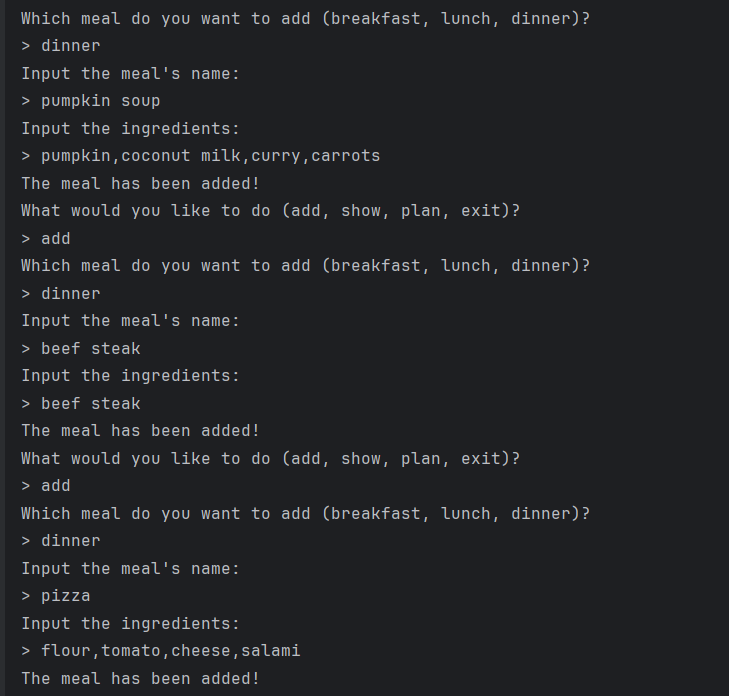
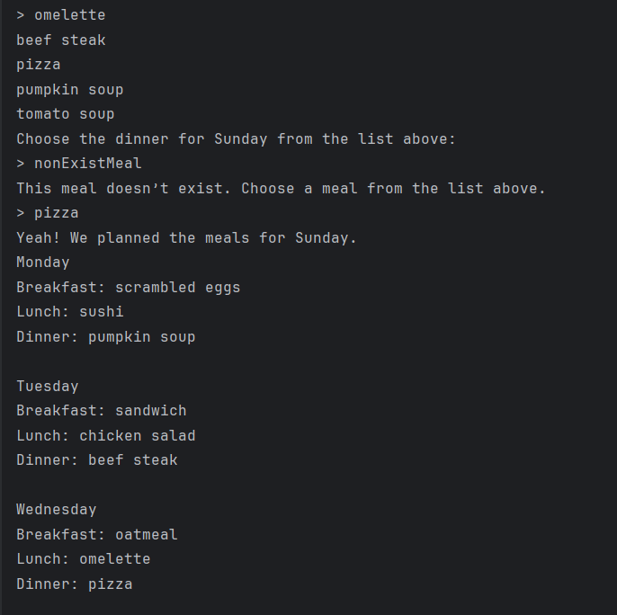
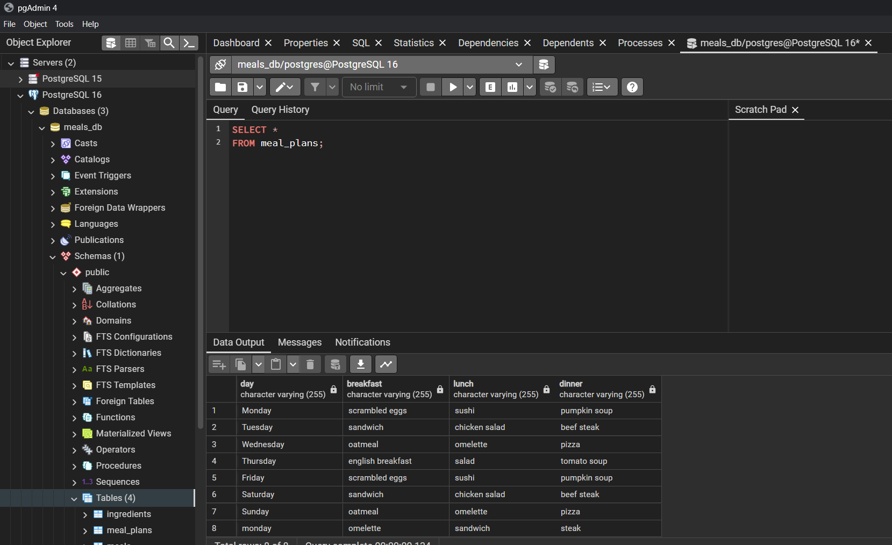

# Hyperskill-MealPlanner-RDBMS
A project as part of the Hyperskill Java certification, where we create a Meal Planner app that connects to a POSTGREs database, built from scratch.   

You can view the source code in either MealPlanner_code_main.java or download the "MealPlanner_Github" file for intellij for easy viewing.  

Example of finished version running to add a user's meal: 

  

Example of finished version to create a meal plan: 

  

Example of PgAdimn4 connected to the PostgreSQL database and data persisting:

  

This product is not intended for commercial use or resale of any kind.
